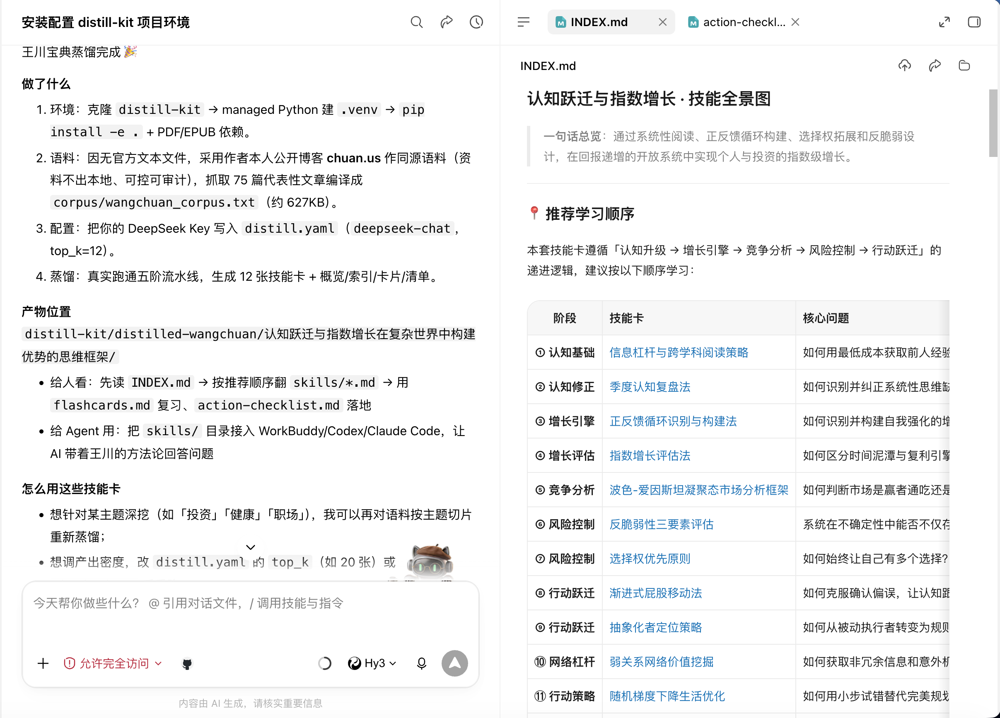

[](https://github.com/input-output-x/distill-kit/actions/workflows/ci.yml)
[](./LICENSE)
[](https://www.python.org)

# distillkit · 知识蒸馏工具 / Knowledge Distiller

> [中文](#中文) · [English](#english)
>
> 把一本书 / 一个视频 / 任意长文本，**蒸馏**成一组可被 AI 和人直接复用的结构化知识包。
> Turn a book / a video / any long text into a structured **knowledge pack** of reusable skills.

---

<a id="中文"></a>

# distillkit · 知识蒸馏工具

> 把一本书 / 一个视频 / 任意长文本，**蒸馏**成一组可被 AI 和人直接复用的结构化知识包。

「蒸馏」这个词来自袋鼠帝（kangarooking）提出的 **仓颉 Skill** 思路：通用大模型回答问题常常「差一口气」，
原因是它没读过你手头那些**模型没见过、但对你很有用**的资料。蒸馏就是把这些资料（书、视频、行业报告、内部文档……）
里的**方法论、框架、原则、思维模型**提炼出来，变成一份份可反复调用的「技能卡」。

本仓库是这一思想的**开源、可自托管实现**：你用自己的 API Key，在你的机器上跑，资料不出本地。
（与仓颉 Skill 是不同项目，提示词与管线均为原创实现。）

## 它能做什么

给定一段内容，distillkit 跑一条**五阶蒸馏流水线**，产出：

| 文件 | 内容 |
| --- | --- |
| `BOOK_OVERVIEW.md` | 整书/文稿全局理解：一句话总结、核心论点、结构、关键主题 |
| `INDEX.md` | 技能全景图 + 推荐学习顺序 + 使用说明 |
| `skills/*.md` | 若干张「技能卡」（Agent Skill 兼容格式），每张是一个可直接照做的方法论 |
| `flashcards.md` | 复习卡片（Q&A），用于记忆 |
| `action-checklist.md` | 可立即执行的行动清单 |
| `rejected.md` | 被淘汰的候选及原因 |
| `distill.meta.json` | 生成元信息 |

## 安装

需要 Python 3.10+。

```bash
git clone https://github.com/input-output-x/distill-kit.git
cd distill-kit
python -m venv .venv && source .venv/bin/activate
pip install -e .
# 如需读 PDF / EPUB：
pip install pypdf ebooklib beautifulsoup4
```

## 快速开始

```bash
# 1) 生成示例配置
distill --init

# 2) 填好 API Key（或设环境变量），然后蒸馏一本书
export DISTILL_API_KEY=sk-xxx
distill book 我的书.pdf --output-dir ./distilled

# 3) 蒸馏一段视频（先准备好字幕/转录文本）
distill video 演讲字幕.txt

# 4) 蒸馏一段文本
echo "这里是一段方法论丰富的文字……" | distill text -

# 不想配 Key 也能看效果：
distill book 示例.txt --mock --output-dir ./distilled
```

## 支持的输入

| 类型 | 命令 | 说明 |
| --- | --- | --- |
| 书 | `distill book 文件` | 支持 `.txt` `.md` `.pdf`(需 pypdf) `.epub`(需 ebooklib) |
| 视频 | `distill video 字幕.txt` | 传入转录/字幕文本；在线视频请先用 yt-dlp/whisper 转写 |
| 文本 | `distill text -` | 从 stdin 或参数读入任意长文本 |

> 为什么不在工具里直接下载视频/文章？因为摄取（尤其是带图 PDF、付费内容）
> 最好由你掌控。工具只做「文本 → 知识包」，干净、可控、可审计。

## 配置模型

distillkit 兼容任意 **OpenAI Chat Completions** 端点，所以 OpenAI / DeepSeek /
通义 / 智谱 / 本地 llama.cpp / vLLM 都能用。在 `distill.yaml` 或环境变量里改：

```yaml
llm:
  base_url: https://api.deepseek.com/v1
  api_key: sk-xxx
  model: deepseek-chat
distill:
  top_k: 12          # 保留多少张技能卡
  language: zh       # zh / en
  chunk_chars: 6000  # 长文切片大小
  output_dir: ./distilled
```

环境变量：`DISTILL_API_KEY` / `DISTILL_BASE_URL` / `DISTILL_MODEL` / `DISTILL_TOP_K` / `DISTILL_LANGUAGE`。

> 经验：蒸馏比较费 token。想省钱先用便宜的 Flash 模型试水；带图资料优先选能识图的模型/客户端。

## 蒸馏出来的东西怎么用

- **给人看**：先读 `INDEX.md`，遇到问题翻对应 `skills/<name>.md` 照做；用 `flashcards.md` 复习、`action-checklist.md` 落地。
- **给 Agent 用**：把 `skills/` 目录接入 Claude Code / Codex / WorkBuddy 等 Agent 框架，
  让 AI 带着这本书的方法论回答问题，而不是泛泛而谈。相当于给 AI 请了一位「读过这本书的领域专家」。

## 真实案例 · 王川宝典

> 用 distillkit 把 75 篇王川博客转成一组可调用的方法论技能卡，整个过程不到一杯咖啡的时间。

**输入**：从 `chuan.us` 同源资料抓取 75 篇文章，合并成约 627 KB 的 `corpus/wangchuan_corpus.txt`。

**配置**：

```yaml
llm:
  base_url: https://api.deepseek.com/v1
  model: deepseek-chat
distill:
  top_k: 12
  language: zh
```

**产物**（`distilled-wangchuan/认知跃迁与指数增长：在复杂世界中构建优势的思维框架/`）：

- 12 张技能卡，覆盖「认知升级 → 增长引擎 → 竞争分析 → 风险控制 → 行动跃迁」五大阶段
- `BOOK_OVERVIEW.md` 全书一句话总结 + 核心论点 + 结构
- `INDEX.md` 技能全景图 + 推荐学习顺序
- `flashcards.md` 复习卡片
- `action-checklist.md` 行动清单

**12 张技能卡一览**（按推荐学习顺序）：

| # | 阶段 | 技能卡 | 解决的核心问题 |
| --- | --- | --- | --- |
| ① | 认知基础 | 信息杠杆与跨学科阅读策略 | 如何用最低成本获取前人经验 |
| ② | 认知修正 | 季度认知复盘盘 | 如何识别并纠正系统性思维盲点 |
| ③ | 增长引擎 | 正反馈循环识别与构建法 | 如何识别并构建自我强化的增长飞轮 |
| ④ | 增长评估 | 指数增长评估法 | 如何区分时间泥潭与复利引擎 |
| ⑤ | 竞争分析 | 波色-爱因斯坦凝聚态市场分析框架 | 如何判断市场是赢家通吃还是分散 |
| ⑥ | 风险控制 | 反脆弱性三要素评估 | 系统在不确定性中能否不仅存活 |
| ⑦ | 风险控制 | 选择权优先原则 | 如何始终让自己有多个选择 |
| ⑧ | 行动跃迁 | 渐进式屁股移动法 | 如何克服确认偏见，让认知变现 |
| ⑨ | 行动跃迁 | 抽象化者定位策略 | 如何从被动执行者转变为规则制定者 |
| ⑩ | 网络杠杆 | 弱关系网络价值挖掘 | 如何获取非冗余信息和意外机会 |
| ⑪ | 行动策略 | 随机梯度下降生活优化 | 如何用小步试错替代完美规划 |
| … | (略) | … | … |

**适用场景**：投资决策 / 个人成长 / 健康管理 / 职场跃迁 —— 任何想深挖某位高手方法论的领域都能用。

<a href="./docs/case-wangchuan.png"></a>

## 五阶蒸馏法（管线）

1. **通读（Survey）**：把长文切片，逐片提取要点，再汇总成全局理解。
2. **萃取（Extract）**：从全局理解中列出值得蒸馏的候选知识单元。
3. **筛滤（Filter）**：保留最值得的 `top_k` 条，其余给淘汰理由。
4. **结晶（Crystallize）**：把每个保留单元写成一张技能卡（触发条件 / 步骤 / 原则 / 案例 / 反模式）。
5. **汇编（Compile）**：生成索引、复习卡片、行动清单。

## 许可证

[MIT](./LICENSE) · 仅英文文档见 [README.en.md](./README.en.md)

---

<a id="english"></a>

# distillkit · Knowledge Distiller

> Turn a book / a video / any long text into a structured **knowledge pack** of reusable skills.

"Distillation" here follows the idea popularized by kangarooking's **Cangjie Skill**: a general LLM
often answers with a "something's missing" feeling because it hasn't read the material that is
*new to the model but valuable to you*. Distillation extracts the methodologies, frameworks,
principles and mental models from that material into callable "skill cards".

This repo is an **open-source, self-hostable implementation** of that idea — your API key, your
machine, your data stays local. (Distinct from Cangjie Skill; prompts and pipeline are original.)

## What it produces

| File | Content |
| --- | --- |
| `BOOK_OVERVIEW.md` | Global understanding: one-liner, core thesis, structure, key topics |
| `INDEX.md` | Skill panorama + recommended order + usage |
| `skills/*.md` | Executable skill cards (Agent-Skill compatible) |
| `flashcards.md` | Q&A review cards |
| `action-checklist.md` | Actionable checklist |
| `rejected.md` | Rejected candidates + reasons |
| `distill.meta.json` | Run metadata |

## Install

Requires Python 3.10+.

```bash
git clone https://github.com/input-output-x/distill-kit.git
cd distill-kit
python -m venv .venv && source .venv/bin/activate
pip install -e .
# For PDF / EPUB support:
pip install pypdf ebooklib beautifulsoup4
```

## Quick start

```bash
# 1) Generate a sample config
distill --init
# 2) Set your API key, then distill a book
export DISTILL_API_KEY=sk-xxx
distill book my-book.pdf --output-dir ./distilled
# 3) Distill a video (prepare transcript/subtitle text first)
distill video transcript.txt
# 4) Distill arbitrary text
echo "some methodology-rich text..." | distill text -
# See it work without a key:
distill book sample.txt --mock --output-dir ./distilled
```

## Inputs

| Type | Command | Notes |
| --- | --- | --- |
| Book | `distill book file` | `.txt` `.md` `.pdf` (needs pypdf) `.epub` (needs ebooklib) |
| Video | `distill video subs.txt` | Transcript/subtitle text; transcribe online videos with yt-dlp/whisper first |
| Text | `distill text -` | Any text from stdin or args |

> Why not download videos/articles inside the tool? Ingestion (especially image-heavy PDFs, paid
> content) is best left under your control. The tool only does "text → knowledge pack": clean,
> controllable, auditable.

## Models

distillkit is compatible with **any OpenAI Chat Completions endpoint**, so OpenAI / DeepSeek /
Qwen / GLM / local llama.cpp / vLLM all work. Configure in `distill.yaml` or env vars:

```yaml
llm:
  base_url: https://api.deepseek.com/v1
  api_key: sk-xxx
  model: deepseek-chat
distill:
  top_k: 12          # how many skill cards to keep
  language: en       # zh / en
  chunk_chars: 6000  # chunk size for long text
  output_dir: ./distilled
```

Env vars: `DISTILL_API_KEY` / `DISTILL_BASE_URL` / `DISTILL_MODEL` / `DISTILL_TOP_K` / `DISTILL_LANGUAGE`.

> Tip: distillation can use a lot of tokens. Try a cheap Flash model first; for image-rich material
> prefer a model/client that can read images.

## How to use the output

- **For humans**: read `INDEX.md` first, then follow the relevant `skills/<name>.md`; review with
  `flashcards.md` and act with `action-checklist.md`.
- **For Agents**: wire the `skills/` directory into Claude Code / Codex / WorkBuddy etc., so the AI
  answers with the book's methodology instead of generic advice — like hiring a "domain expert who
  actually read the book".

## Real case study · Wangchuan's corpus

> Distilling 75 of Wangchuan's essays into a callable methodology pack takes about as long as brewing a coffee.

**Input**: 75 essays fetched from `chuan.us`, merged into a single 627 KB corpus file (`corpus/wangchuan_corpus.txt`).

**Config**:

```yaml
llm:
  base_url: https://api.deepseek.com/v1
  model: deepseek-chat
distill:
  top_k: 12
  language: zh
```

**Output** (`distilled-wangchuan/认知跃迁与指数增长：在复杂世界中构建优势的思维框架/`):

- 12 skill cards spanning 5 stages: `认知升级 → 增长引擎 → 竞争分析 → 风险控制 → 行动跃迁`
- `BOOK_OVERVIEW.md` — one-liner + core thesis + structure
- `INDEX.md` — skill panorama + recommended order
- `flashcards.md` — review cards
- `action-checklist.md` — actionable checklist

**12 skill cards at a glance** (in recommended order):

| # | Stage | Skill card | Core question it answers |
| --- | --- | --- | --- |
| ① | Cognition basics | Information leverage & cross-disciplinary reading | How to access predecessors' experience at minimum cost |
| ② | Cognition fix | Quarterly cognitive review | How to spot and correct systematic blind spots |
| ③ | Growth engine | Positive-feedback loop detection & construction | How to identify and build self-reinforcing flywheels |
| ④ | Growth eval | Exponential-growth evaluation | How to tell time-sinks from compounding engines |
| ⑤ | Competition analysis | BEC market-state analysis framework | Winner-takes-all vs. fragmented: which market are you in? |
| ⑥ | Risk control | Antifragility three-factor evaluation | Will the system not just survive, but benefit from uncertainty? |
| ⑦ | Risk control | Optionality-first principle | How to always keep multiple choices open |
| ⑧ | Action leap | Gradual-ass-moving method | How to overcome confirmation bias and ship cognition |
| ⑨ | Action leap | Abstraction-positioning strategy | How to shift from executor to rule-maker |
| ⑩ | Network leverage | Weak-tie network value mining | How to get non-redundant info and surprise opportunities |
| ⑪ | Action strategy | SGD-style life optimization | Small-step trial-and-error vs. perfect planning |
| … | (more) | … | … |

**Use it for**: investing, personal growth, health, career leapfrogs — any domain where you want to extract one expert's hard-won methodology.

<a href="./docs/case-wangchuan.png"></a>

## The five-stage pipeline

1. **Survey** — split long text into chunks, extract key points per chunk, then synthesize a global understanding.
2. **Extract** — list candidate knowledge units worth distilling from the global understanding.
3. **Filter** — keep the top_k most valuable units; give a rejection reason for the rest.
4. **Crystallize** — write each kept unit as a skill card (trigger / steps / principles / examples / anti-patterns).
5. **Compile** — generate the index, review cards, and action checklist.

## License

[MIT](./LICENSE) · 中文文档见 [README.md](./README.md)
